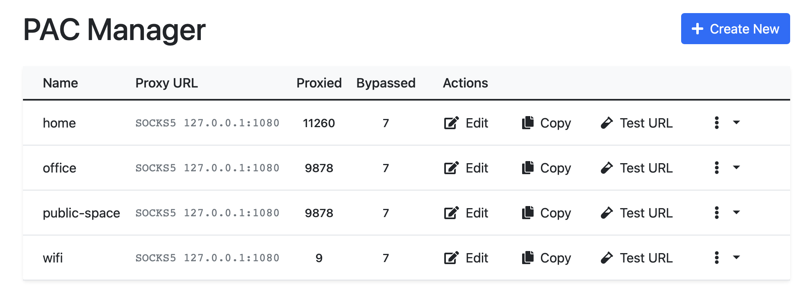
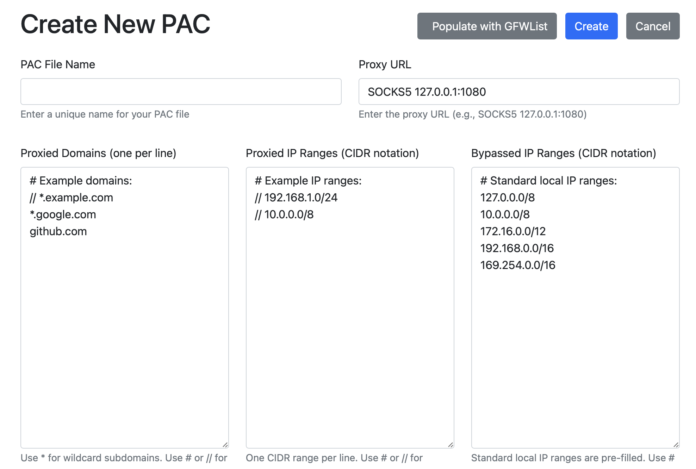

# Proxy Auto-Configuration (PAC) Manager

A web-based application for managing Proxy Auto-Configuration (PAC) files.

## Features

- Create, edit, and delete PAC files
- Test URLs against PAC rules
- View access logs for each PAC file
- Manage proxy rules including:
  - Proxied domains
  - Proxied IP ranges
  - Bypassed IP ranges

## Installation

1. Clone the repository:
   ```bash
   git clone https://github.com/dodid/pac-proxy-manager.git
   cd pac-proxy-manager
   ```

2. Create a virtual environment:
   ```bash
   python -m venv venv
   source venv/bin/activate  # On Windows use `venv\Scripts\activate`
   ```

3. Install dependencies:
   ```bash
   pip install -r requirements.txt
   ```

4. Run the application:
   ```bash
   uvicorn app.main:app
   ```

5. Access the application at `http://localhost:8000`

## Screenshots





## Contributing

Contributions are welcome! Please follow these steps:

1. Fork the repository
2. Create a new branch (`git checkout -b feature/YourFeature`)
3. Commit your changes (`git commit -m 'Add some feature'`)
4. Push to the branch (`git push origin feature/YourFeature`)
5. Create a new Pull Request

## License

MIT License - See [LICENSE](LICENSE) for more information